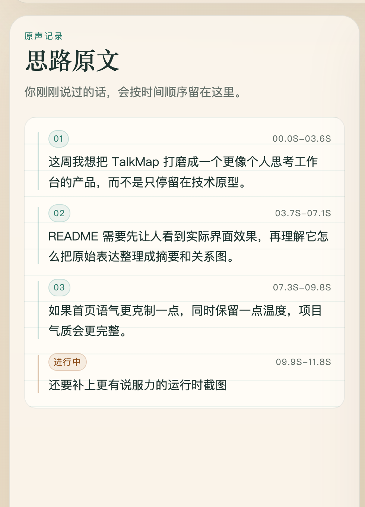
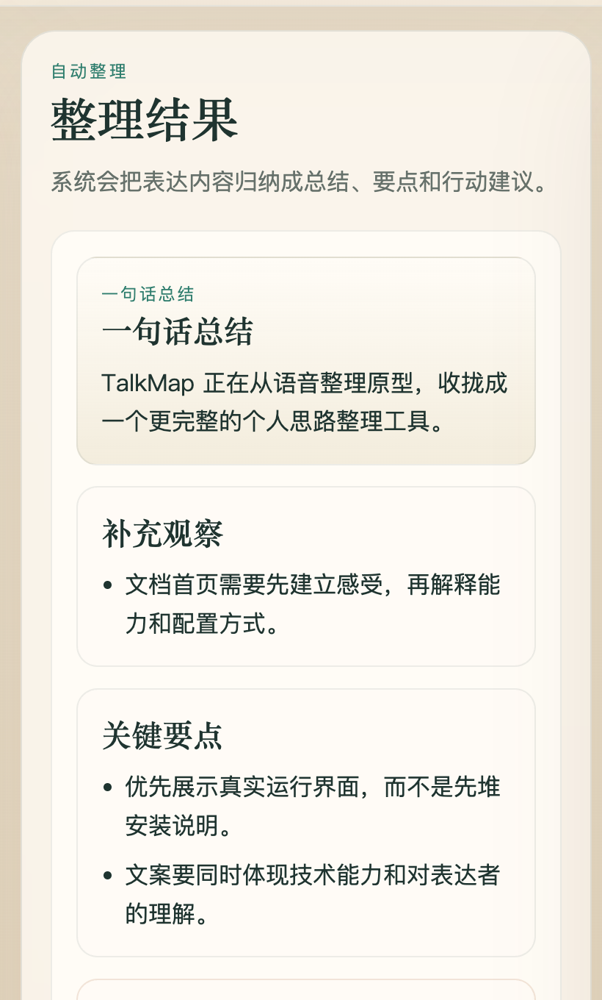
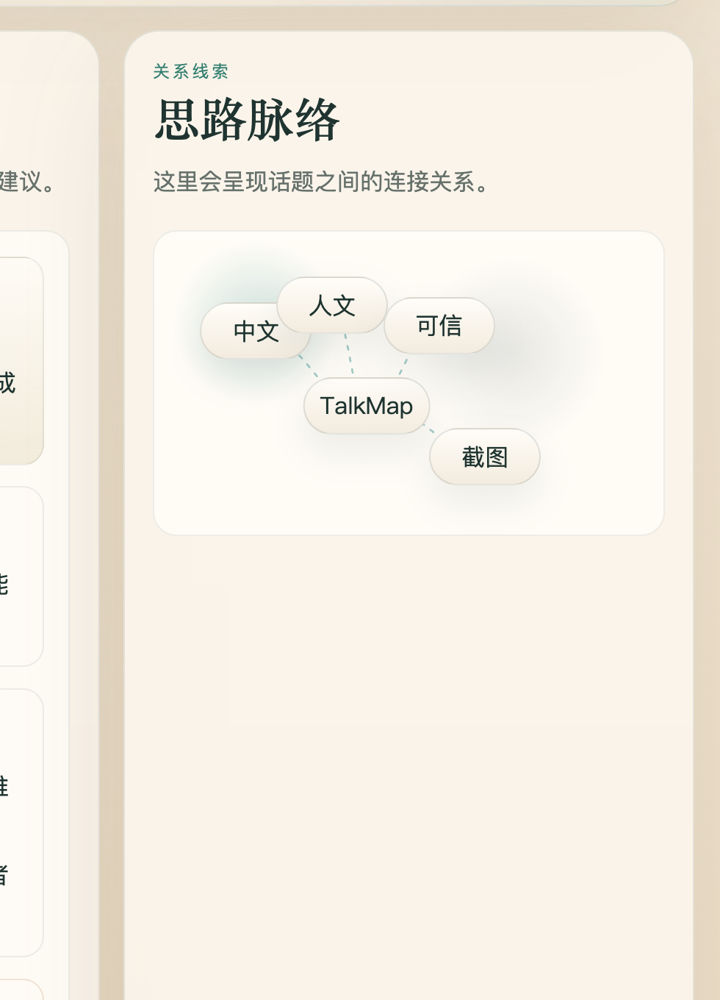

# TalkMap

<div align="center">
  <p>
    
    
    
  </p>
  <p><strong>张口即现脉络，落音即生灵感。</strong></p>
  <p>TalkMap 是一块极简的 AI 原生思维画布。忘掉键盘与繁杂的笔记。尽情向 TalkMap 倾诉你杂乱无章的想法，AI 引擎将实时聆听、提纯，并在你开口的瞬间，无缝构建出结构分明的思维导图与行动指引。</p>
  <p>
    <a href="README.en.md">English</a> ·
    <a href="#运行时预览">运行时预览</a> ·
    <a href="#快速开始">快速开始</a>
  </p>
</div>

## 运行时预览

页面不是“录音之后再看结果”，而是一边表达、一边沉淀。下面是三个核心面板的真实运行态局部截图：

<table>
  <tr>
    <td width="33%">
      
    </td>
    <td width="33%">
      
    </td>
    <td width="33%">
      
    </td>
  </tr>
  <tr>
    <td valign="top"><strong>你的思维原典</strong><br />保留你每一次灵光乍现，未加修饰的原始思绪将在此沉淀。</td>
    <td valign="top"><strong>AI 提纯引擎</strong><br />经由 AI 提炼的核心论点、关键高亮与下一步行动指南，洞见即刻展现。</td>
    <td valign="top"><strong>动态思维网络</strong><br />AI 精准捕获复杂概念间的隐秘关联，织就出发散性的结构化图谱。</td>
  </tr>
</table>

## 为什么做 TalkMap

很多时候，人不是没有思路，而是思路还停留在口头表达里。你一边说，一边会冒出新的分支、补充和转折。TalkMap 的目标不是抢先替你下结论，而是先把这段表达完整接住，再慢慢抽出总结、重点和关系，让思考过程本身也能留下来。

## 适合什么表达场景

- 一个人长段口述，把脑子里还散着的东西先说出来
- 写方案、写文章、做分享前，先用语音梳理结构
- 做复盘或记录灵感时，希望同时保留原话和后续整理结果
- 想在本地优先的前提下，把语音、摘要和关系图放到同一个界面

## 它现在能做什么

- **聚焦灵感倾听**：一键开启录音，以极简干扰的界面接住你的连篇思绪
- **AI 提纯引擎**：基于对话动态生成的颗粒高亮片段和逻辑行动建议
- **动态思维网络**：分析词汇间隐秘的引力波，实时勾勒辐射状思维发散图
- **会话持久化**：全本地的数据落盘，支持导出最纯粹的 JSON 和 Markdown 内容

整个链路是本地优先的：前端在浏览器里录音，通过 WebSocket 把语音片段发给 FastAPI 后端；后端负责转写，再把文本交给大模型做结构化整理。

## 技术栈

- 前端：React、Vite、`@ricky0123/vad-web`
- 后端：FastAPI、WebSocket、Pydantic
- 语音识别：本地 `faster-whisper`、Google Speech-to-Text、Groq Whisper
- 文本整理：Ollama、LM Studio、OpenAI、OpenRouter

## 运行前你需要准备

- Python 3.11+
- Node.js 18+
- 一条语音识别路径：
  - 本地 `faster-whisper`
  - Google Speech-to-Text 凭据
  - Groq API key
- 一条大模型路径：
  - Ollama
  - LM Studio
  - OpenAI
  - OpenRouter

## 快速开始

### 1. 安装后端依赖

```bash
pip install -e "backend[dev,asr]"
pip install uvicorn
```

如果你只打算用托管 ASR，比如 Google 或 Groq，其实装 `backend[dev]` 就够了。`asr` 这个 extra 只给本地 `faster-whisper` 用。

### 2. 安装前端依赖

```bash
npm --prefix frontend install
```

### 3. 复制配置文件

```bash
cp .env.example .env
```

默认模板的思路是：

- 语音识别走本地 `faster-whisper`
- 文本整理走 OpenRouter

如果你已经提前下载了 Whisper 模型，`ASR_MODEL` 可以直接写成本地绝对路径。

一套最常见的本地配置大概是这样：

```bash
ASR_PROVIDER=local
ASR_MODEL=large-v3
ASR_DEVICE=auto
ASR_COMPUTE_TYPE=float16

LLM_PROVIDER=openrouter
OPENROUTER_MODEL=google/gemini-2.0-flash-001
OPENROUTER_API_KEY=你的 OpenRouter key
```

如果你改用 Google Speech-to-Text，记得把 `ASR_PROVIDER=google`，然后在启动后端前先导出凭据：

```bash
export GOOGLE_APPLICATION_CREDENTIALS=/绝对路径/你的-service-account.json
```

### 4. 启动

开两个终端：

```bash
# 终端 1：后端
uvicorn app.main:app --app-dir backend --reload

# 终端 2：前端
npm --prefix frontend run dev
```

然后打开 [http://127.0.0.1:5173](http://127.0.0.1:5173)，点一下 `开始梳理`，允许麦克风权限，就能开始说了。

如果你用的是本地 Whisper，而且模型还没缓存，第一次启动会先下载一次。<br />
如果你用的是 OpenRouter 免费模型，偶尔遇到上游限流也很正常。那种情况一般不用纠结，换个 `OPENROUTER_MODEL` 再试就行。

## ASR 配置

在 `.env` 里设置 `ASR_PROVIDER`：

| 方案 | 托管？ | 需要什么 | 配置项 |
| --- | --- | --- | --- |
| `local` | 否 | 本机安装 `faster-whisper` | `ASR_MODEL`, `ASR_DEVICE`, `ASR_COMPUTE_TYPE` |
| `google` | 是 | Google Application Default Credentials | `ASR_LANGUAGE_CODE`, `GOOGLE_STT_MODEL` |
| `groq` | 是 | Groq API key | `ASR_LANGUAGE_CODE`, `GROQ_ASR_MODEL`, `GROQ_API_KEY` |

### 本地 Whisper

```bash
ASR_PROVIDER=local
ASR_MODEL=large-v3
ASR_DEVICE=auto
ASR_COMPUTE_TYPE=float16
```

### Google Speech-to-Text

```bash
ASR_PROVIDER=google
ASR_LANGUAGE_CODE=zh-CN
GOOGLE_STT_MODEL=latest_long
```

### Groq Whisper

```bash
ASR_PROVIDER=groq
ASR_LANGUAGE_CODE=zh-CN
GROQ_ASR_MODEL=whisper-large-v3
GROQ_API_KEY=your-groq-key
```

## LLM 配置

在 `.env` 里设置 `LLM_PROVIDER`：

| 方案 | 本地运行 | 需要 API Key | 配置项 |
| --- | --- | --- | --- |
| `ollama` | 是 | 否 | `OLLAMA_BASE_URL`, `OLLAMA_MODEL` |
| `lmstudio` | 是 | 否 | `LMSTUDIO_BASE_URL`, `LMSTUDIO_MODEL` |
| `openai` | 否 | 是 | `OPENAI_API_KEY`, `OPENAI_MODEL` |
| `openrouter` | 否 | 是 | `OPENROUTER_API_KEY`, `OPENROUTER_MODEL` |

### OpenRouter

```bash
LLM_PROVIDER=openrouter
OPENROUTER_MODEL=google/gemini-2.0-flash-001
OPENROUTER_API_KEY=你的 OpenRouter key
```

拿 key 的地址在这里：[openrouter.ai/keys](https://openrouter.ai/keys)

### Ollama

```bash
ollama pull llama3.1:8b
ollama serve
```

```bash
LLM_PROVIDER=ollama
OLLAMA_MODEL=llama3.1:8b
```

## API

| 方法 | 路径 | 说明 |
| --- | --- | --- |
| GET | `/api/health` | 看后端里 ASR 和 LLM 有没有就绪 |
| GET | `/api/sessions` | 列出已保存会话 |
| GET | `/api/session/{id}/export.json` | 导出会话 JSON |
| GET | `/api/session/{id}/export.md` | 导出会话 Markdown |
| DELETE | `/api/session/{id}` | 删除一个已保存会话 |
| WS | `/ws/session` | 实时会话 WebSocket |

## 开发时常用检查

```bash
python -m pytest backend/tests -q
npm --prefix frontend test
npm --prefix frontend run build
```

## 目录结构

```text
backend/
  app/
    asr/                 # 本地、Google、Groq 三套 ASR 引擎
    llm/                 # 大模型客户端和 provider 工厂
    prompts/             # 结构化摘要提示词
    routes/              # 导出接口和会话列表接口
    services/            # 摘要服务和转写服务
    config.py            # 从环境变量读取配置
    main.py              # FastAPI 入口
    models.py            # Pydantic 数据模型
    session_store.py     # JSON 持久化和批量写入
    ws.py                # WebSocket 会话主循环
  tests/
frontend/
  src/
    components/          # 录音条、原文面板、摘要面板、关系图面板
    hooks/               # 麦克风和 VAD 逻辑
    lib/                 # WebSocket 客户端和图布局工具
    state/               # 会话状态管理
```

## 当前限制

- 现在的 VAD 是“说完一段、停一下再送去转写”，不是逐词流式出字
- WebSocket 还没有鉴权和限速
- 长会话会反复基于全部已确认文本重做摘要
- 这个仓库更适合本地开发和原型验证，不是现成的生产部署方案
